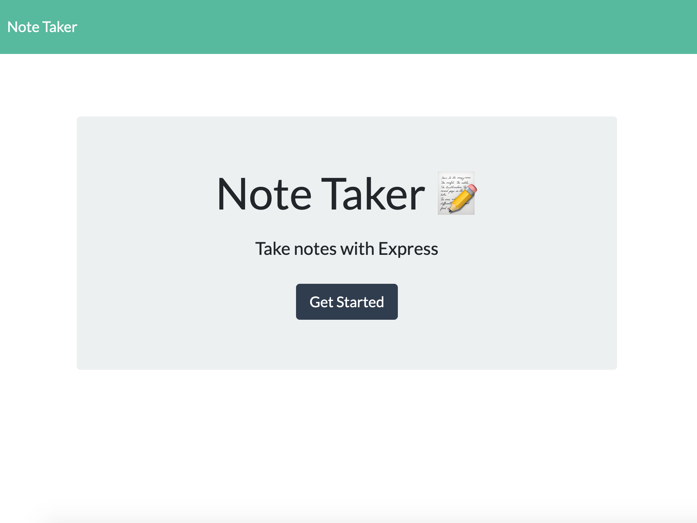
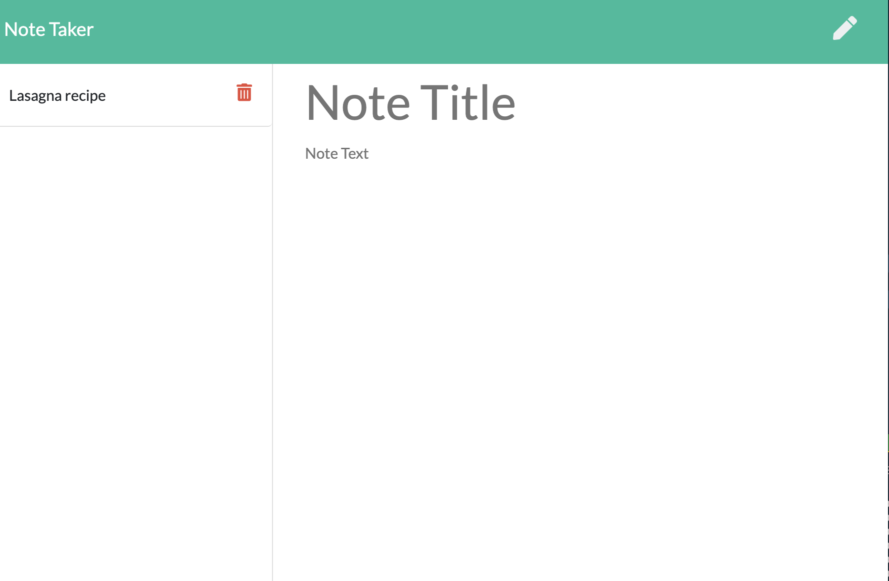

# Express Note Taker

## User Story

As a user, I want to be able to write and save notes. I want to be able to delete notes I've written before so that I can organize my thoughts and keep track of tasks I need to complete.

## Table of Content

* [Motivation](#motivation)
* [Description](#description)
* [Requirements](#requirements)
* [License](#License)
* [Screenshots](#screenshots)
* [Link to Heroku](#link-to-Heroku)
* [Tools](#tools)

## Motivation

For users that need to keep track of a lot of information, it's easy to forget or be unable to recall something important. Being able to take persistent notes allows users to have written information available when needed.

## Description

This is an application that can be used to write, save, and delete notes. This application will use an express backend and save and retrieve note data from a JSON file.

* The following HTML routes should be created:
  * GET `/notes` - Should return the `notes.html` file.
  * GET `*` - Should return the `index.html` file

* The application should have a `db.json` file on the backend that will be used to store and retrieve notes using the `fs` module.

* The following API routes should be created:
  * GET `/api/notes` - Should read the `db.json` file and return all saved notes as JSON.
  * POST `/api/notes` - Should receive a new note to save on the request body, add it to the `db.json` file, and then return the new note to the client.

* DELETE `/api/notes/:id` - Should receive a query parameter containing the id of a note to delete. This means you'll need to find a way to give each note a unique `id` when it's saved. In order to delete a note, you'll need to read all notes from the `db.json` file, remove the note with the given `id` property, and then rewrite the notes to the `db.json` file.

## Requirements 

* Functional, deployed application.
* Navbar must be consistent on each page.
* Navbar on each page must contain links to Home/About, Contact, and Portfolio pages.
* All links must work.
* Must use semantic html.
* Each page must have valid and correct HTML. (use a validation service)
* Must contain your personalized information. (bio, name, images, links to social media, etc.)
* Must properly utilize Bootstrap components and grid system.

## License

MIT

## Screenshots

## Link to Heroku

<https://rocky-temple-72161.herokuapp.com/>

## Tools

* Visual Studio Code <https://code.visualstudio.com>
* Create a package using npm init -y
* Instal express package <https://www.npmjs.com/package/express>
* Deploy application in heroku <https://signup.heroku.com/>